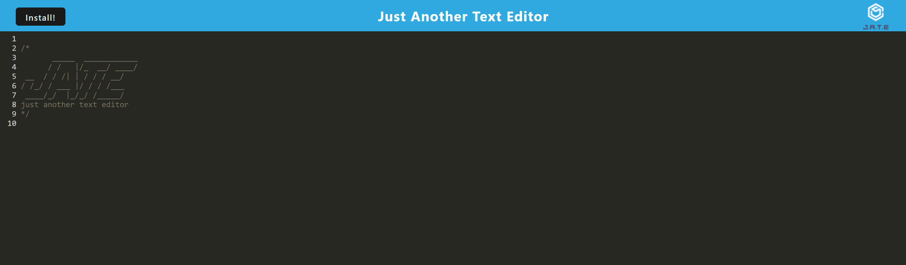

# Just A Text Editor - A Progressive Web Application

## Description

This is a simple text editor that allows you to enter text, and when you either click somewhere else/leave the page and come back, the text will remain. Additionally, the user is able to downloadd the application and use it offline. This is done using webpacks and service workers.

## Visuals

### A screenshot of what the app looks like when you refresh with no text in the editor

### A video of the app in action; both deployed to Heroku and used offline as a downloadable application

## Usage

Since this app is deployed to Heroku, all you need to do to use it is to follow [this link](https://salty-beach-18613-c3f440d62eae.herokuapp.com/), and you'll be taken straight to the app. Once you're there, all you need to do to use it is begin adding text! Data gets saved on 'blur' events which occur when you click somewhere that isn't the editor, but you can also save text by refreshing the page. Basically, no matter what you do, the text you enter will persist. The same applies to when you download the app, only instead of refreshing it will save when you exit.

Something else to note is that data will persist between the executable and the Heroku page!

## License

MIT License

Copyright (c) 2023 zaingova

Permission is hereby granted, free of charge, to any person obtaining a copy
of this software and associated documentation files (the "Software"), to deal
in the Software without restriction, including without limitation the rights
to use, copy, modify, merge, publish, distribute, sublicense, and/or sell
copies of the Software, and to permit persons to whom the Software is
furnished to do so, subject to the following conditions:

The above copyright notice and this permission notice shall be included in all
copies or substantial portions of the Software.

THE SOFTWARE IS PROVIDED "AS IS", WITHOUT WARRANTY OF ANY KIND, EXPRESS OR
IMPLIED, INCLUDING BUT NOT LIMITED TO THE WARRANTIES OF MERCHANTABILITY,
FITNESS FOR A PARTICULAR PURPOSE AND NONINFRINGEMENT. IN NO EVENT SHALL THE
AUTHORS OR COPYRIGHT HOLDERS BE LIABLE FOR ANY CLAIM, DAMAGES OR OTHER
LIABILITY, WHETHER IN AN ACTION OF CONTRACT, TORT OR OTHERWISE, ARISING FROM,
OUT OF OR IN CONNECTION WITH THE SOFTWARE OR THE USE OR OTHER DEALINGS IN THE
SOFTWARE.